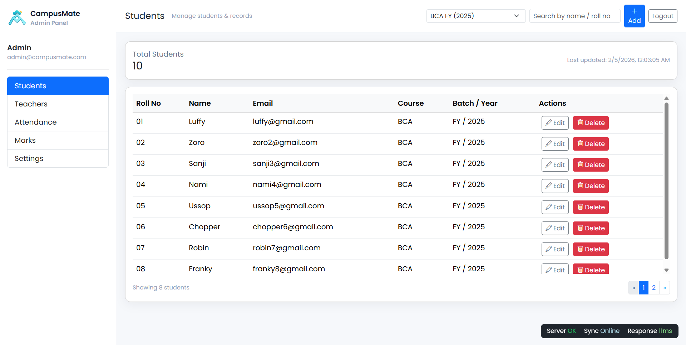
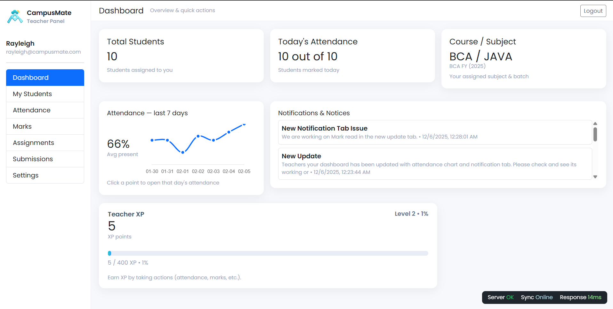
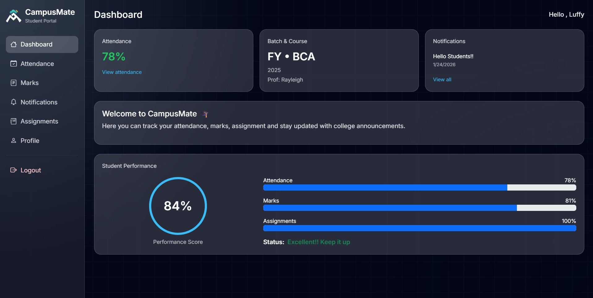

<h1 align="center">
  
  CampusMate
</h1>

<p align="center">
  <b>Smart Student Management System</b><br/>
  Final Year Project • Full-Stack • Role-Based System
</p>

<p align="center">
  
  
  
  
</p>

---

## 🚀 Live Deployment

CampusMate is fully deployed using modern cloud platforms:

- **Frontend (Admin / Teacher)** → Deployed on **Vercel**
- **Frontend (Student Portal)** → Deployed on **Vercel** (Seprated for different URL)
- **Backend API** → Deployed on **Render**
- **Database** → Hosted on **Railway (MySQL Cloud)**


> The frontend communicates securely with the live backend API using JWT-based authentication.

---

## 📌 About the Project

**CampusMate** is a role-based Student Management System designed to digitize
college academic workflows.

It provides **separate dashboards** for:

- 👨‍💼 Admin
- 👨‍🏫 Teacher
- 👨‍🎓 Student

Each role has **its own UI, permissions, and features**.

✔ Final Year Project  
✔ Portfolio-ready  
✔ Real-world use case

---

## ✨ Features Overview

### 👨‍💼 Admin

- Manage teachers & students
- Create courses and batches
- Assign teachers
- Send notifications
- Monitor system data

### 👨‍🏫 Teacher

- View assigned students
- Mark attendance
- Enter marks
- Create & manage assignments
- Review submissions with feedback

### 👨‍🎓 Student

- View attendance & performance
- View marks
- Submit assignments
- Receive notifications
- Manage profile

---

## 🔐 Authentication & Security

- JWT based authentication
- Role-based access control
- Protected routes
- Password hashing (bcrypt)
- Environment variables for secrets

---

## 🛠 Tech Stack

| Layer    | Technology                       |
| -------- | -------------------------------- |
| Frontend | HTML, CSS, JavaScript, Bootstrap |
| Backend  | Node.js, Express.js              |
| Database | MySQL                            |
| Auth     | JWT                              |
| Tools    | bcrypt, dotenv, multer           |

---

## ⚙️ Setup Guide (Local)

### 1️⃣ Clone Repository

```bash
git clone https://github.com/rororonoa/CampusMate.git
cd campusmate
```

### 2️⃣ Backend Setup

```bash
cd backend
npm install
```

Create `.env` inside `backend/`:

```env
DB_HOST=localhost
DB_USER=root
DB_PASSWORD=your_password
DB_NAME=campusmate
JWT_SECRET=your_secret_key
PORT=5000
```

Run backend:

```bash
npm run dev
```

### 3️⃣ Frontend Setup

- Open frontend using **VS Code Live Server**
- Ensure API URL:

```js
const API = "http://localhost:5000/api";
```

---

## 📸 Screenshots

### Admin Dashboard



### Teacher Dashboard



### Student Dashboard



---

## 🎯 Project Purpose

- Final Year Academic Project
- Demonstrates full-stack skills
- Real-world student management system
- Portfolio & resume ready

---

## 👤 Author

**Sumeet Shetty**
BCA – Final Year

---

## 📜 License

MIT License
